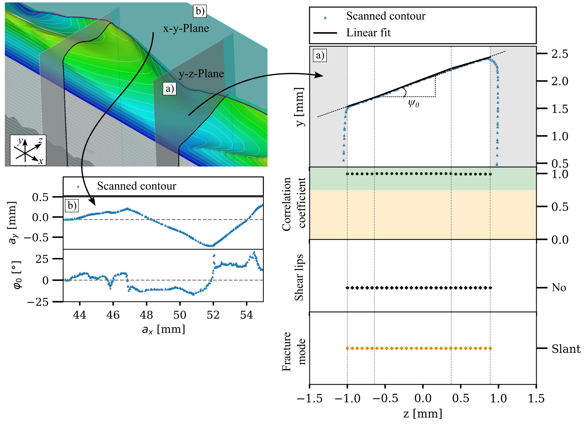

# Fracture surface evaluation tool

The fracture surface evaluation tool is utilised for the analysis and description of a fractured surface given by a 3D-Scan.  

This repository contains the code used to generate the results of the research article
[](https://doi.org/10.1016/j.engfracmech.2024.110664          )

```
Vanessa Schöne, Florian Paysan and Eric Breitbarth. (2024)
The relationship between crack front twisting, plastic zone and da/dN-dK curve of fatigue cracks in AA2024-T3. 
```

## Dependencies
*  <a href="https://www.python.org/downloads/release/python-310/" target="_blank">Python 3.10</a>

## Installation

1. Create a virtual environment of Python 3.10 and activate it.
2. Install the required packages using the following command:
```shell
pip install -r requirements.txt
```

The repository contains the following folders:
* `01_raw_stl`: Containing an example of a .stl file from a 3D scan
* `02_results`: Results obtained from the given examples. This includes examples of the sliced and linearly approximated contours as well as the postprocessing to characterize the contour with regards to the occurence of shear lips and the fracture mode. 
* `fracture_surface_utils`: Neccesary functions to read and process data inputs

## What is this all about?
A 3D scanner is used to digitise the fracture surface after material separation or crack propagation into a digital 3D model[**1**]. 
The contours are projected onto the plane using cutting planes and then piecewise linearly approximated. As part of the analysis, relevant parameters such as the angle of inclination at the respective position of the cutting plane are taken into account. One can also characterize the resulting crack path. The procedure described not only enables the digitisation of a complex geometric structure, but also allows the assignment of three-dimensional parameters such as the fracture mode to the crack-describing variables.


|  |
|:--:|
| **_Visualisation of the digitalized fractured surface_** |

A 3D PDF of the .stl file can be found here (Needs Adobe Reader): 

[./Example_Images/test_mesh.pdf](.../Example_Images/test_mesh.pdf)

## How does it work?
Given a .stl file of the contour as input, one can set a slicing plane along the x-y-plane for a given z-coordinate (Equals the crack path) or along the y-z-plane for a given x coordinate (equals a through-thickness slice). As seen below, the scanned contour is projected towards the slicing plane. This allows us to get the crack path and crack kink angle &#966;_0. 
The sectional plane y-z generates the scanned contour, which is first masked in the respective outer area and the centre section is then linearly interpolated. In a second step, the centre section is linearly approximated with a piecewise linear fit. Shear lips [**2**] can be identified by differentiating between cases, taking into account the length and angle of the segments, among other things. The fracture surface characteristics are classified via a further case differentiation. This allows, for example, the analysis of the crack twist angle &#968;_0 along the crack lenght.  

|  |
|:--:|
| **_Slicing planes and contour projection and evaluation_** |


## What is the output?
See `02_results` for given data in  `01_raw_stl`:

For the y-z plane (b):
* Visualization of the contour itself, segment position and contours of each fitted segment
* Visualization of the masked and processed contour, correlation coefficient of linear approximation, occurence of shear lips and resulting mode classification
* .txt file containing the set evaluation parameters
* .csv file containing geometric description of the segments and mode classification

For the x-y plane (a):
* Visualization of the contour itself and crack kinking angle
* .csv file containing the raw contour at given z coordinate
* .csv file containing the masked contour within set limits and crack kinking angle

 ## License and Limitations
The package is developed **for research only and must not be used for any production or specification purposes**. 
The Package is **under current development and all functionalities are on a prototype level**. 
Feel free to use the code, however, **we do not guarantee in any form for its flawless implementation and execution**.
 
## Get in touch
If you are interested in the code, or in our work in general, feel free to contact me 
via email at [vanessa.schoene@dlr.de](mailto:vanessa.schoene@dlr.de) or [vanessa.schoene5@gmail.com](mailto:vanessa.schoene5@gmail.com)

## Intellectual Property and Authorship 
This package is property of the German Aerospace Center (Deutsches Zentrum für Luft- und Raumfahrt e.V. - DLR) 
and was developed in the Institute of Materials Research. Feel free to check out our [LinkedIn channel](https://www.linkedin.com/company/dlr-wf).

References:

1. **Zeiss** Industrial 3D Scanning. [https://www.zeiss.com/metrology/en/systems/optical-3d/3d-scanning.html](https://www.zeiss.com/metrology/en/systems/optical-3d/3d-scanning.html)
2. **Zuidema J. et al. (2004)** Shear lips on fatigue fracture surfaces of aluminum alloys. 
   _FFEMS Volume28, Issue1-2_ [https://doi.org/10.1111/j.1460-2695.2004.00837.x       ](https://doi.org/10.1111/j.1460-2695.2004.00837.x       )
