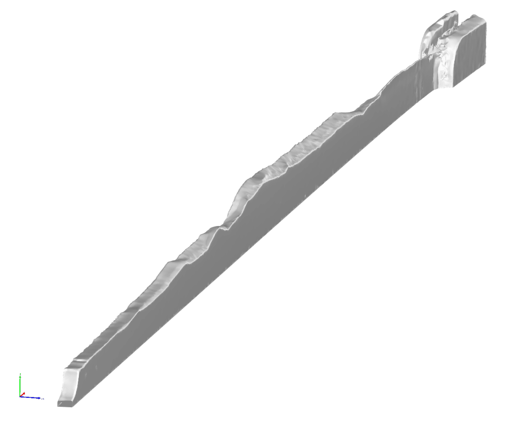

# Fracture surface evaluation tool

The fracture surface evaluation tool is utilised for the analysis and description of a fractured surface given by a 3D-Scan.  

This repository contains the code used to generate the results of the research article
[](https://doi.org/10.1016/j.engfracmech.2024.110664   )

```
Vanessa Schöne, Florian Paysan and Eric Breitbarth. (2024)
The relationship between crack front twisting, plastic zone and da/dN-dK curve of fatigue cracks in AA2024-T3. 
```

## Dependencies
*  <a href="https://www.python.org/downloads/release/python-310/" target="_blank">Python 3.10</a>

## Installation

1. Create a virtual environment of Python 3.10 and activate it.
2. Install the required packages using the following command:
```shell
pip install -r requirements.txt
```

The repository contains the following folders:
* `01_raw_stl`: Containing an example of a .stl file from a 3D scan
* `02_results`: Results obtained from the given examples. This includes examples of the sliced and linearly approximated contours as well as the postprocessing to characterize the contour with regards to the occurence of shear lips and the fracture mode. 
* `fracture_surface_utils`: Neccesary functions to read and process data inputs

## What is this all about?
A 3D scanner is used to digitise the fracture surface after material separation or crack propagation into a digital 3D model[**1**]. 
The contours are projected onto the plane using cutting planes and then piecewise linearly approximated. As part of the analysis, relevant parameters such as the angle of inclination at the respective position of the cutting plane are taken into account. One can also characterize the resulting crack path. The procedure described not only enables the digitisation of a complex geometric structure, but also allows the assignment of three-dimensional parameters such as the fracture mode to the crack-describing variables.


|  |
|:--:|
| **_Visualisation of the digitalized fractured surface_** |

A 3D PDF of the .stl file can be found here (Needs Adobe  Reader): 

[./Example_Images/test_mesh.pdf](.../Example_Images/test_mesh.pdf)


References:

1. **Zeiss** Industrial 3D Scanning. [https://www.zeiss.com/metrology/en/systems/optical-3d/3d-scanning.html](https://www.zeiss.com/metrology/en/systems/optical-3d/3d-scanning.html)
2. 
